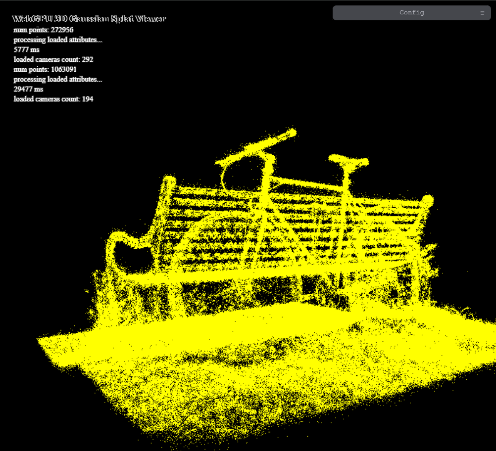
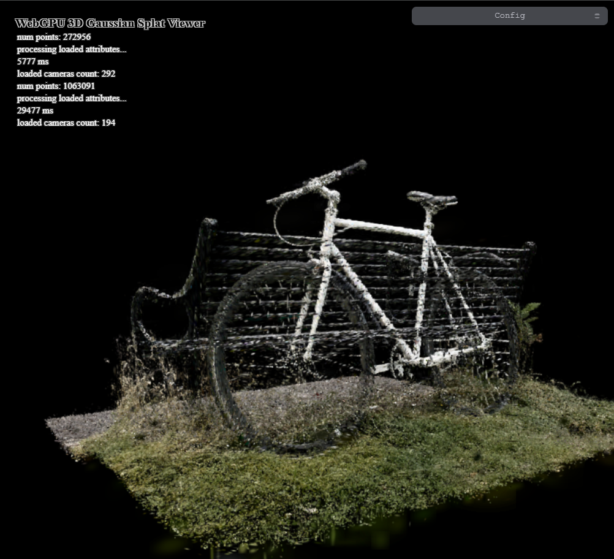
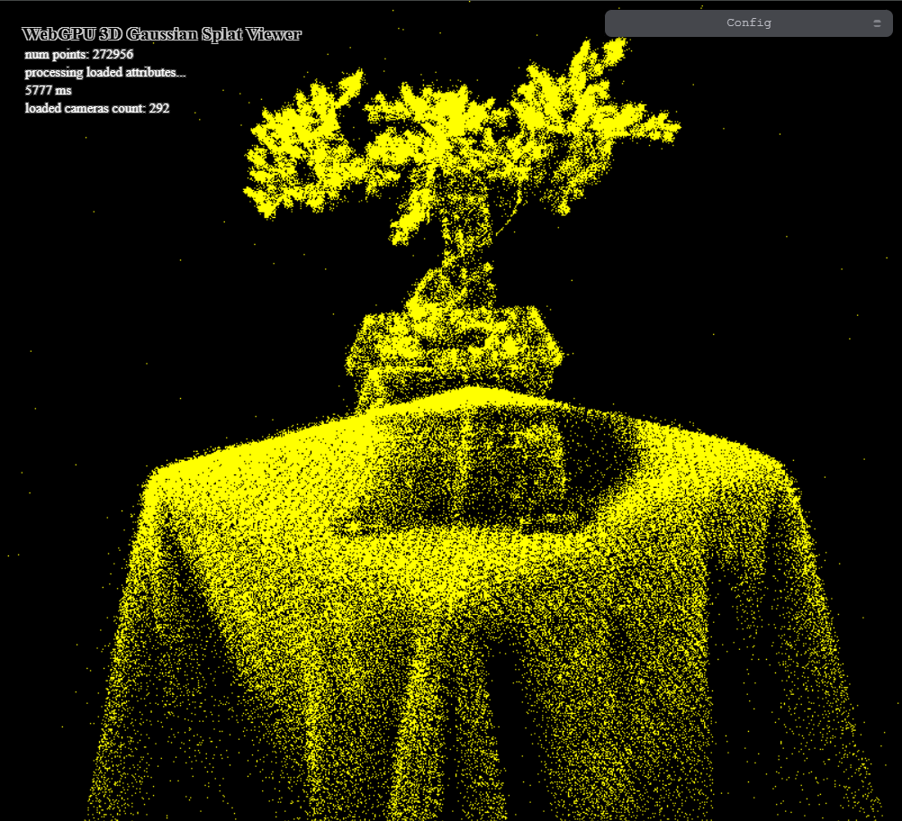
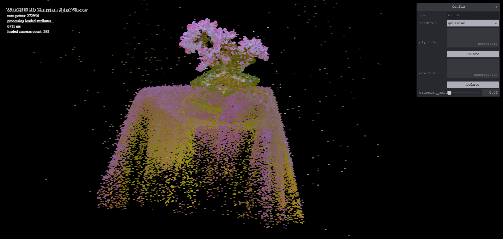
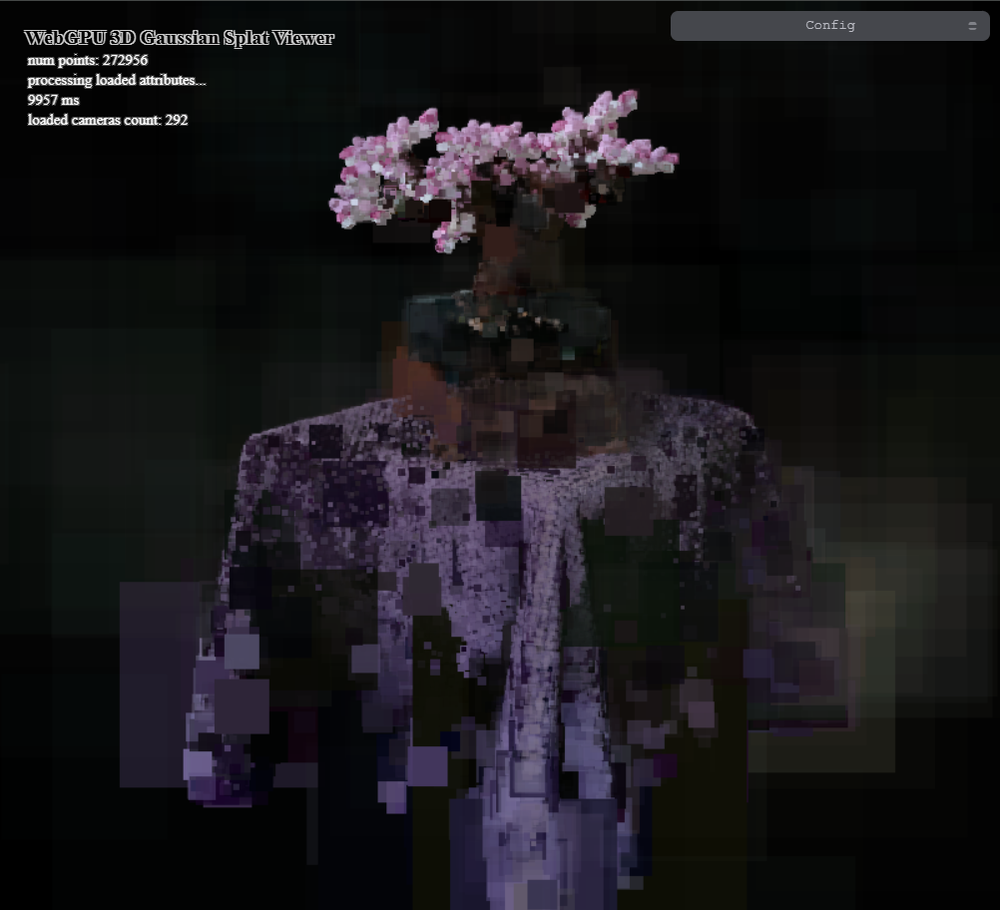
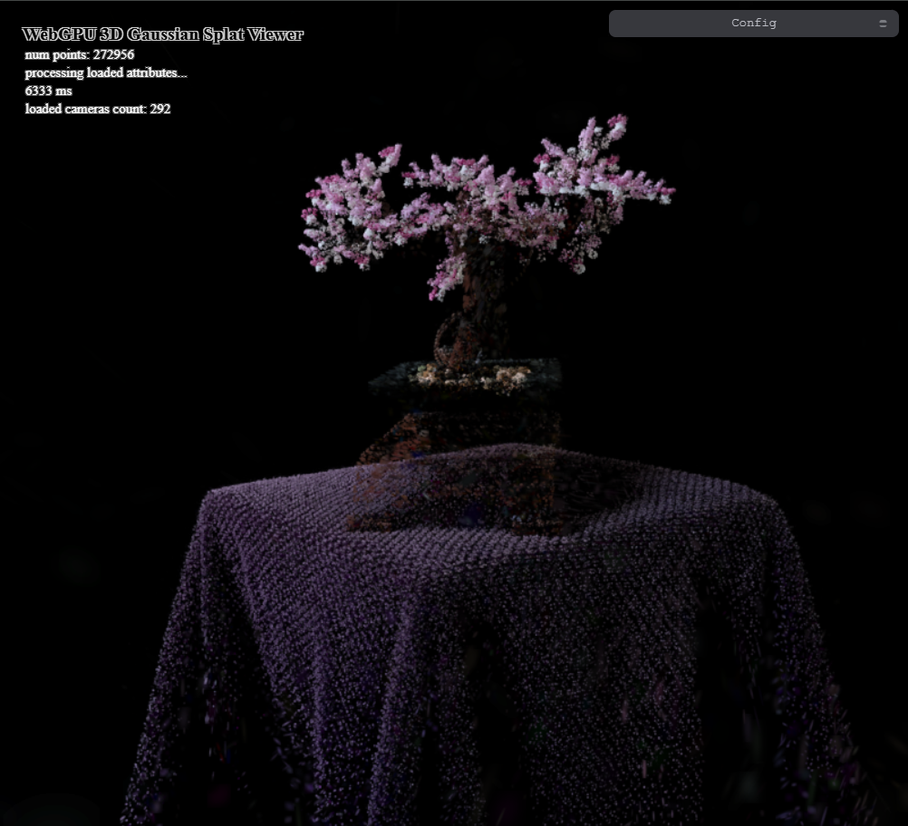

# Project5-WebGPU-Gaussian-Splat-Viewer

* Hongyi Ding
  * [LinkedIn](https://www.linkedin.com/in/hongyi-ding/), [personal website](https://johnnyding.com/)
* Tested on: Windows 11, Intel(R) Core(TM) Ultra 7 155H @ 3800MHz 16GB, (SEAS Virtual Lab), Intel(R) Arc(TM) Graphics

### Live Demo

[WebGPU 3D Gaussian Splat Viewer](https://johnnysist.github.io/Project5-WebGPU-Gaussian-Splat-Viewer/)

### Demo Video/GIF

[Demo for WebGPU Gaussian Splat Viewer](https://www.youtube.com/watch?v=dZ3qP298KiE)

### Overview

This project implements a WebGPU Gaussian Splat Viewer that can process and render user uploaded 3D point cloud data files in PLY format. The user can also interactively adjust camera parameters and splatting multiplier to see different rendering effects. The original paper is [3D Gaussian Splatting for Real-Time Radiance Field Rendering](https://repo-sam.inria.fr/fungraph/3d-gaussian-splatting/), and this blog also helps in implementation: [kwea123/gaussian_splatting_notes](https://github.com/kwea123/gaussian_splatting_notes).

### Preprocessing & Sorting

The preprocessing shader `preprocess.wgsl` computes the splat parameters from the input gaussian data, including position, color, conic, radius coefficients, and depth for sorting. It computes the positions in world space, view space and NDC space for the caculation of attributes and passing them to the vertex shader. It uses the rotation and scaling information to compute the covariance matrices in 3D and 2D space, and also the conic coefficients which is useful in the fragment shader. It also computes the color with spherical harmonics data and opacity. Finally, it stores the depth values as an unsigned integer for sorting.

### Rendering

The vertex shader will render a quad for each splat. The size of the quad is determined by the radius attribute computed in the preprocessing step. It will also pass the necessary attributes to the fragment shader, including position, color, and conic coefficients.

The fragment shader computes the Gaussian function based on the conic coefficients and the distance from the splat center. Since the color is already computed in the preprocessing step, it only needs to compute the alpha value, which will decrease as the distance from the center increases. Alpha blend is enabled.

### Performance Analysis

- Compare your results from point-cloud and gaussian renderer, what are the differences?
  
  - As we can see from the screenshots below, the gaussian renderer produces much realistic results compared to the point-cloud renderer. The point-cloud renderer only renders each gaussian as a single point, with the same color. While the gaussian renderer renders each gaussian as a quad with color and opacity, bringing much more details to the scene. However, because the gaussian renderer involves more preprocessing and computing, it is also much slower than the point-cloud renderer.
  
    
  
    
  
- For gaussian renderer, how does changing the workgroup-size affect performance? Why do you think this is?

  - An appropriate workgroup size will approximately be within the range of 64 to 512. The performance depends on the GPU device and the shaders. A larger workgroup size can increase parallelism and reduce the overhead caused by scheduling; However, it also requires more resources per workgroup, which may lead to a limitation and slowdown if the memory source turn into shared physical memory, which is much slower than GPU's local memory.

- Does view-frustum culling give performance improvement? Why do you think this is? 
  
  - Yes, view-frustum culling gives performance improvement. By culling the gaussians that are hidden from the camera, we can save a lot of computation and rendering time. If we render all the gaussians, even for the gaussians that are not visible, it will still cost much time to calculate the positions, colors, radius, to sort and to render them as quads and fragments.
  
- Does number of guassians affect performance?  Why do you think this is? 
  
  - Yes, the number of gaussians affects performance. The more gaussians there are, the more computation and rendering time is needed. By comparing the rendering time for bonsai.ply (300k gaussians) and bicycle.ply (1M gaussians), we can see that the rendering time for bicycle.ply is much longer than bonsai.ply. It takes more time to initialize the buffers, to preprocess and sort the gaussians, and to render them.

### Screenshots

### Credits

- [Vite](https://vitejs.dev/)
- [tweakpane](https://tweakpane.github.io/docs//v3/monitor-bindings/)
- [stats.js](https://github.com/mrdoob/stats.js)
- [wgpu-matrix](https://github.com/greggman/wgpu-matrix)
- Special Thanks to: Shrek Shao (Google WebGPU team) & [Differential Guassian Renderer](https://github.com/graphdeco-inria/diff-gaussian-rasterization)
